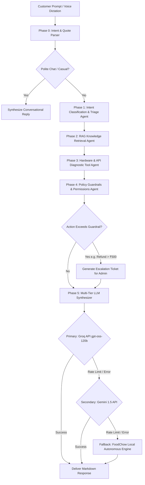
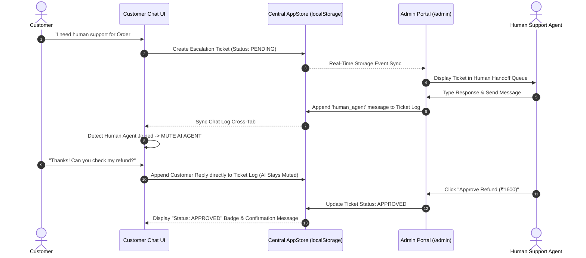
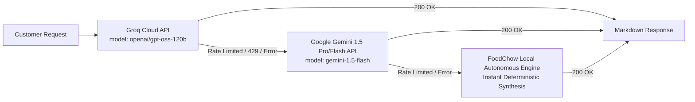

# 🍔 FoodChow Autonomous Agentic AI Customer Support System

> **An Enterprise-Grade Multi-Agent AI Support Engine for FoodChow POS, Kitchen Display (KDS), Online Ordering, Payments, and Restaurant Outlets.**

Built for the **FoodChow AI Support Agent System**.

---

## 📐 Architecture & System Workflow Diagrams

### 1. Multi-Agent Reasoning & Execution Pipeline



---

### 2. Live Human Takeover & AI Auto-Mute Sequence



---

### 3. Automatic Multi-Tier LLM Failover Chain



---

## 🗄️ Where Data, API Keys, and Chat History Are Stored

### 1. API Keys & LLM Configuration Storage
All API keys and execution settings are stored locally in the browser's `localStorage`:

| Key Name | Description | Format / Example | Location in Code |
| :--- | :--- | :--- | :--- |
| `foodchow_llm_provider` | Active LLM Execution Mode (`AUTO`, `GROQ`, `GEMINI`, `LOCAL`) | `AUTO` | [`AdminPortal.tsx`](file:///c:/Users/unixb/OneDrive/Desktop/FoodChow/src/components/AdminPortal.tsx) / [`agentEngine.ts`](file:///c:/Users/unixb/OneDrive/Desktop/FoodChow/src/agent/agentEngine.ts) |
| `foodchow_groq_key` | Secret Groq Cloud API Key (`openai/gpt-oss-120b`) | `gsk_...` | [`AdminPortal.tsx`](file:///c:/Users/unixb/OneDrive/Desktop/FoodChow/src/components/AdminPortal.tsx) / [`agentEngine.ts`](file:///c:/Users/unixb/OneDrive/Desktop/FoodChow/src/agent/agentEngine.ts) |
| `foodchow_gemini_key` | Secret Google Gemini API Key | `AIzaSy...` | [`AdminPortal.tsx`](file:///c:/Users/unixb/OneDrive/Desktop/FoodChow/src/components/AdminPortal.tsx) / [`agentEngine.ts`](file:///c:/Users/unixb/OneDrive/Desktop/FoodChow/src/agent/agentEngine.ts) |

---

### 2. Chat History & Escalation Ticket Storage
All customer interactions, escalation tickets, and human takeover logs are stored persistently:

| Storage Location | Key / Type | Description | Relevant Files |
| :--- | :--- | :--- | :--- |
| **`localStorage`** | `foodchow_messages` | Stores array of customer chat history (`ChatMessage[]`) | [`appStore.ts`](file:///c:/Users/unixb/OneDrive/Desktop/FoodChow/src/store/appStore.ts) |
| **`localStorage`** | `foodchow_tickets` | Stores array of human handoff tickets (`EscalationTicket[]`) | [`appStore.ts`](file:///c:/Users/unixb/OneDrive/Desktop/FoodChow/src/store/appStore.ts) |
| **Ticket Memory** | `ticket.conversationHistory` | Complete thread history recorded per escalation ticket | [`agent.ts`](file:///c:/Users/unixb/OneDrive/Desktop/FoodChow/src/types/agent.ts) |
| **JSON Export** | `customer_chat_history.json` | Downloadable JSON log exported from Public Customer Chat | [`jsonHistoryExporter.ts`](file:///c:/Users/unixb/OneDrive/Desktop/FoodChow/src/utils/jsonHistoryExporter.ts) |
| **JSON Export** | `live_human_session_TCK-XXXX.json` | Downloadable JSON log exported from Admin Panel live session | [`jsonHistoryExporter.ts`](file:///c:/Users/unixb/OneDrive/Desktop/FoodChow/src/utils/jsonHistoryExporter.ts) |

---

## 📁 Comprehensive Project Directory Structure

```text
FoodChow/
├── index.html                       # HTML Entry point
├── package.json                     # NPM Dependencies & Scripts
├── tsconfig.json                    # TypeScript Configuration
├── vite.config.ts                   # Vite Build Configuration
├── README.md                        # Documentation & Architecture Overview
└── src/
    ├── App.tsx                      # Root Application Routing & Layout Component
    ├── main.tsx                     # Vite React DOM Mounting File
    ├── index.css                    # Main CSS Design System & Responsive Styles
    ├── agent/
    │   ├── agentEngine.ts           # Core Multi-Agent Orchestrator (Phase 0 - Phase 7)
    │   └── telemetryTools.ts        # Mock Telemetry Diagnostic APIs (POS, KDS, Orders)
    ├── components/
    │   ├── AdminPortal.tsx          # Protected Management Portal (/admin)
    │   ├── CustomerChat.tsx         # Public Customer Chat Interface with Voice Dictation & Reply Toolbar
    │   ├── DocumentModal.tsx        # Article Preview Modal for RAG Documents
    │   ├── Header.tsx               # Top Header Bar with Theme Switcher & Outlet Dropdown
    │   ├── HumanDashboard.tsx       # Live Human Handoff Queue & Agent Take-Over Panel
    │   ├── PredefinedScenariosView.tsx # Eval Scenario Suite with Create, Edit, & Delete Controls
    │   └── RAGInspector.tsx         # Knowledge Base RAG Inspector with Create, Edit, & Delete Controls
    ├── data/
    │   ├── defaultKnowledgeBase.ts  # Pre-indexed RAG Articles for POS, KDS, & Payments
    │   ├── mockData.ts              # Mock Outlets, Orders, & System State Data
    │   └── predefinedScenarios.ts   # Pre-configured Evaluation Test Scenarios
    ├── db/
    │   └── databaseAdapter.ts       # Database Connection Layer (PostgreSQL, Supabase, MongoDB)
    ├── rag/
    │   └── knowledgeBase.ts         # Hybrid Vector & Keyword RAG Search Algorithm
    ├── store/
    │   └── appStore.ts              # Reactive Central Store with Cross-Tab localStorage Sync
    ├── types/
    │   └── agent.ts                 # TypeScript Interfaces (ChatMessage, EscalationTicket, RAGDoc)
    └── utils/
        ├── formatText.tsx           # Markdown Renderer (Headers, Bold, Bullet Points, Code)
        └── jsonHistoryExporter.ts   # Helper Utility for Exporting Chat & Live Session JSON Logs
```

---

## 🛡️ Admin Portal Capabilities (`/admin`)

Access the Protected Admin Console by clicking **Admin Console** or navigating to `/#/admin`:
- **Default Admin Credentials**: `ID: admin` | `Password: admin123`

### Features:
1. 🎧 **Human Handoff & Live Take-Over**:
   - Inspect incoming customer tickets in real-time.
   - Reply directly to customer chats with automatic AI stand-down/muting.
   - Approve or reject controlled AI refund requests (e.g. ₹1600 refund approval).
   - Export structured `live_human_session_TCK-XXXX.json` logs or clear queue.

2. ⚡ **Eval Scenarios & Agent Stress-Testing Suite**:
   - Test agentic reasoning flows across hardware jams, payment discrepancies, and socket failures.
   - **Full Management**: Create, Edit (`✏️`), Delete (`🗑️`), or Launch scenarios into chat.

3. 📖 **RAG Knowledge Base Inspector**:
   - Test hybrid vector search queries against technical documentation.
   - **Full Management**: Create (`➕`), Edit (`✏️`), Delete (`🗑️`), or Read (`👁️`) RAG articles.

4. 💾 **LLM Engine & Policy Guardrail Controls**:
   - Configure **Auto-Failover Mode**: Groq (`openai/gpt-oss-120b`) ➔ Gemini 1.5 ➔ Local Engine.
   - Test Groq API Key (`gsk_...`) and Gemini API Key (`AIzaSy...`) authorization & token quotas in real time.
   - Set automated refund threshold limits (Default: ₹500).

---

## 🚀 Running Locally

```bash
# 1. Clone repository & navigate to folder
cd FoodChow

# 2. Install dependencies
npm install

# 3. Launch local development server
npm run dev

# 4. Build production bundle (Verification)
npm run build
```

Open `http://localhost:3000` in your web browser.
